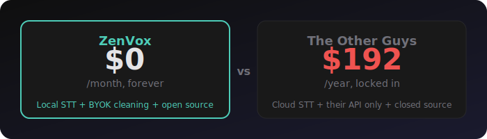
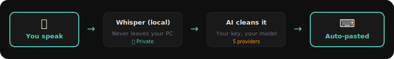
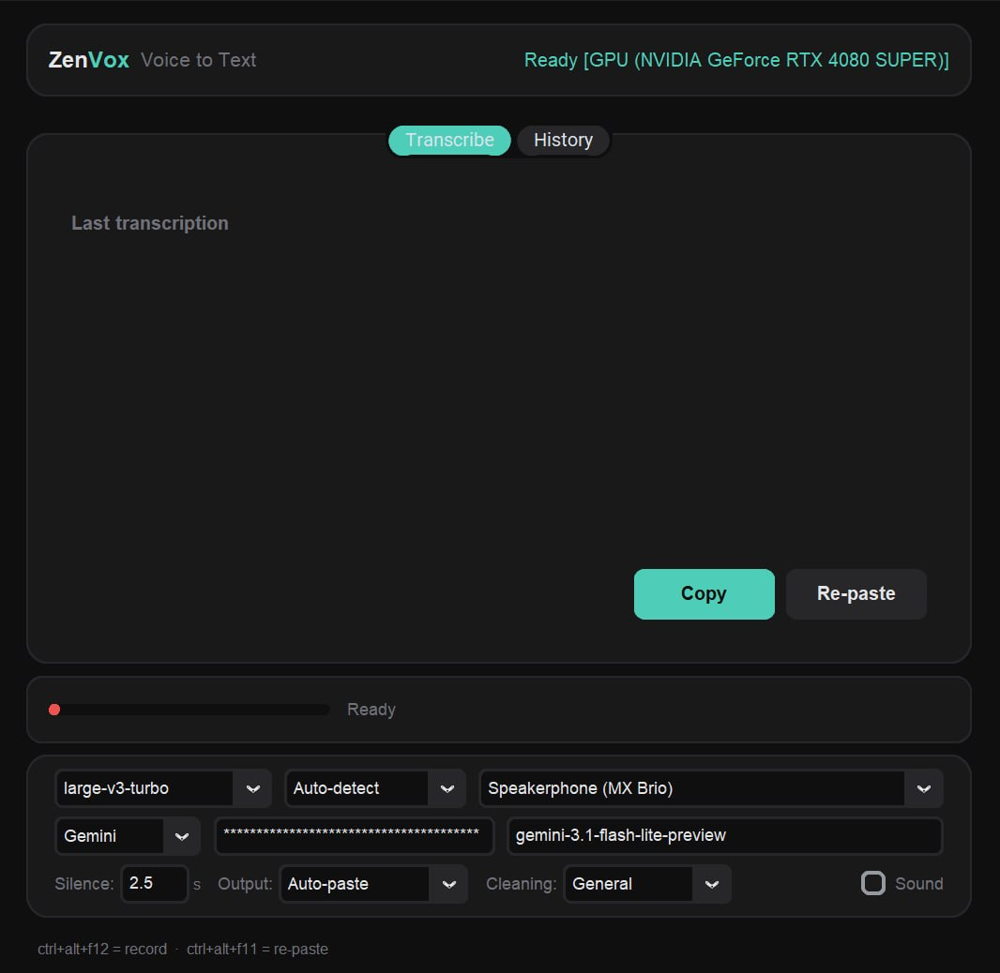
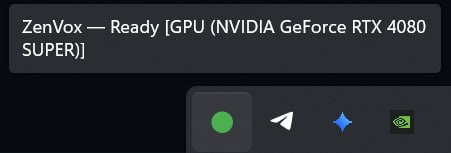

<p align="center">
  
  <h1 align="center">ZenVox</h1>
  <p align="center">
    <strong>Voice to text. Cleaned by AI. Yours to keep.</strong>
  </p>
  <p align="center">
    
    
    
    
    
  </p>
</p>

---

<p align="center">
  
</p>

Wispr Flow charges you **$16/month** to wrap Whisper in a pretty UI and clean your text with an API call.

ZenVox does the same thing for **$0**. Whisper runs locally. Cleaning runs through *your* API key — Gemini free tier, Ollama on your machine, whatever you want. Your audio never leaves your computer for transcription. No subscription. No telemetry. No vendor lock-in.

**Press a hotkey. Talk. It types the cleaned text wherever your cursor is.** That's it. That's the app.

---

## How it works

<p align="center">
  
</p>

1. **Ctrl+Alt+F12** — start recording
2. ZenVox listens. When you stop talking, it auto-stops (VAD silence detection — no button to click)
3. Whisper transcribes your speech locally
4. Your chosen LLM cleans the output — removes filler words, fixes punctuation, preserves meaning
5. The cleaned text is pasted wherever your cursor was

**Ctrl+Alt+F11** — re-paste the last transcription (both hotkeys are configurable)

---

## What you get that Wispr Flow doesn't give you

| | **ZenVox** | **Wispr Flow** |
|---|:---:|:---:|
| Price | **Free** | $8–16/month |
| Audio leaves your machine | **Never** | Yes (cloud STT) |
| Choose your own LLM | **5 providers** | Their API only |
| Use Ollama (fully local, fully private) | **Yes** | No |
| Adjustable silence timeout | **Yes** | No |
| Multiple cleaning modes | **4 presets** | 1 mode |
| Bilingual FR/EN (Franglais) | **Native** | English-centric |
| Searchable history | **SQLite** | No history |
| GPU acceleration | **CUDA auto-detect** | N/A (cloud) |
| Open source | **Yes** | No |

---

## The $0/month stack

ZenVox doesn't require any paid API. Here's what most people use:

| Component | What | Cost |
|-----------|------|------|
| **Whisper** (Faster-Whisper) | Speech-to-text, runs locally | Free |
| **Gemini Flash Lite** | AI text cleaning | Free tier (1500 req/day) |
| **ZenVox** | Glues it together | Free, forever |

If you want fully offline (zero API calls), use **Ollama** as your cleaning provider. Everything stays on your machine.

---

## Features

### Transcription
- **Faster-Whisper** with models: `tiny`, `base`, `small`, `large-v3-turbo`
- **Silero VAD** — auto-stops when you stop talking. Adjustable silence timeout (default 2.5s)
- **GPU acceleration** — auto-detects CUDA. Falls back to CPU gracefully
- Languages: English, French, French Canadian, Auto-detect

### AI Cleaning
Five LLM providers, because your voice-to-text app shouldn't lock you into one vendor:

| Provider | Default Model | API Key? |
|----------|---------------|----------|
| **Gemini** | gemini-3.1-flash-lite-preview | Yes (free tier works) |
| **OpenAI** | gpt-4o-mini | Yes |
| **Anthropic** | claude-haiku-4-5 | Yes |
| **Groq** | llama-3.3-70b-versatile | Yes (free tier works) |
| **Ollama** | llama3.2:3b | No (fully local) |

Four cleaning presets:
- **General** — removes filler words, fixes punctuation, preserves bilingual mix
- **Technical** — preserves camelCase, CLI flags, converts "dot" → `.` in code context
- **Minimal** — only fixes typos and capitalization, keeps everything else
- **Structured** — adds paragraph breaks and bullet lists from rambling speech

### Bilingual / Franglais

ZenVox was built by a bilingual developer who talks like this:

> *"euh j'ai besoin de like checker le workflow pour voir si ca marche"*

Cleaned output:

> *"J'ai besoin de checker le workflow pour voir si ca marche."*

Other tools either butcher the French, translate everything to English, or choke on code-switching. ZenVox's cleaning prompts are specifically engineered for bilingual speech.

### Output
- **Auto-paste** — cleaned text is typed wherever your cursor is (restores your clipboard after)
- **Clipboard only** — copies to clipboard, you paste when ready
- **Append to file** — writes timestamped entries to a text file (great for meeting notes)

### Desktop Experience

<p align="center">
  
</p>

<p align="center">
  
  &nbsp;&nbsp;&nbsp;
  
</p>
- **System tray** — lives in your taskbar, always ready
- **Floating overlay** — pill-shaped indicator at the bottom of your screen during recording/transcription (like Otter.ai)
- **Audio feedback** — optional beep on record start/stop
- **Configurable hotkeys** — change from Ctrl+Alt+F12 to whatever you want
- **History** — full searchable history with raw + cleaned text, duration, model used
- **API keys in Windows Keyring** — not sitting in a plain text config file

---

## Quick Start

### Option 1: Download the .exe (no Python needed)

> **Coming soon** — pre-built releases will be available on the [Releases](../../releases) page.

### Option 2: Run from source

```bash
git clone https://github.com/ZenSystemAI/ZenVox.git
cd ZenVox
pip install ".[all,gpu]"   # or pip install . for CPU-only with no cleaning providers
python zenvox.py
```

Optionally, run `python install.py` to create a Start Menu shortcut and `.ico` file.

### Option 3: Build the .exe yourself

```bash
pip install ".[all,gpu]"
python install.py
build.bat
# Output: dist/ZenVox/ZenVox.exe
```

### First run

1. ZenVox opens its settings window on first launch
2. Pick your **Whisper model** (`large-v3-turbo` for best quality, `base` for speed)
3. Pick your **cleaning provider** (Gemini recommended — paste your API key)
4. Select your **microphone**
5. Close the window — ZenVox lives in your system tray now
6. **Ctrl+Alt+F12** and start talking

---

## Configuration

All settings are persisted in `settings.json` next to the executable. API keys are stored in Windows Credential Manager when available.

| Setting | Default | What it does |
|---------|---------|-------------|
| `model_name` | `large-v3-turbo` | Whisper model size |
| `lang_name` | `Auto-detect` | Transcription language |
| `clean_provider` | `Gemini` | Which LLM cleans your text |
| `clean_model` | `gemini-3.1-flash-lite-preview` | Specific model for cleaning |
| `silence_timeout` | `2.5` | Seconds of silence before auto-stop |
| `output_mode` | `Auto-paste` | Where cleaned text goes |
| `cleaning_preset` | `General` | Which cleaning prompt to use |
| `hotkey_record` | `Ctrl+Alt+F12` | Start/stop recording |
| `hotkey_repaste` | `Ctrl+Alt+F11` | Re-paste last transcription |
| `audio_feedback` | `false` | Beep on record start/stop |

---

## Architecture

```
zenvox.py       Main app — engine, overlay, GUI, tray, hotkeys
config.py       Settings, constants, GPU detection, audio generation
providers.py    Multi-provider LLM cleaning (Gemini, OpenAI, Anthropic, Groq, Ollama)
history.py      SQLite-backed transcription history with search
install.py      Icon conversion + Start Menu shortcut
build.bat       PyInstaller build script
```

The app follows a clean separation: `ZenVoxEngine` (thread-safe recording/transcription/cleaning) is completely independent from `ZenVoxApp` (GUI/tray/hotkeys). You could use the engine headlessly if you wanted.

---

## Requirements

- **Windows 10/11** (uses Win32 hotkey registration + system tray)
- **Python 3.10+** (if running from source)
- **Microphone**
- **NVIDIA GPU** (optional — for faster transcription via CUDA)

---

## Why this exists

I was paying $16/month for Wispr Flow. Then I realized the entire product is:
1. Record audio (free — your OS does this)
2. Run Whisper (free — open source)
3. Clean with an LLM (free — Gemini free tier)
4. Paste the result (free — pyautogui)

So I built my own in a weekend. Then I added the features Wispr Flow wouldn't give me: multiple LLM providers, adjustable silence detection, cleaning presets, bilingual support, and fully local mode via Ollama.

If you're paying for voice-to-text in 2026, you're overpaying.

---

<p align="center">
  <sub>Built with spite, shipped with love.</sub><br>
  <sub>Made by <a href="https://github.com/ZenSystemAI">ZenSystem AI</a></sub>
</p>
