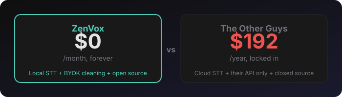
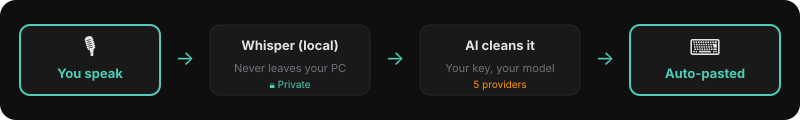
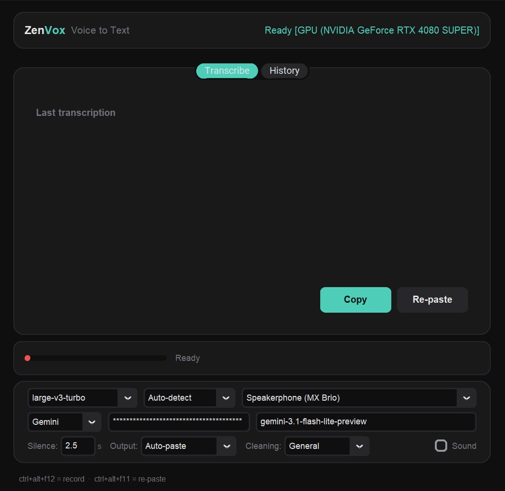
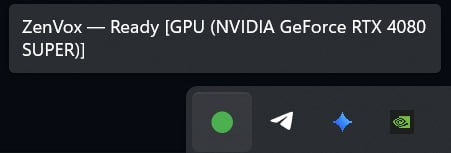

<p align="center">
  
  <h1 align="center">ZenVox</h1>
  <p align="center">
    <strong>Voice to text. Cleaned by AI. Yours to keep.</strong>
  </p>
  <p align="center">
    
    
    
    
    
  </p>
</p>

---

<p align="center">
  
</p>

Wispr Flow charges you **$16/month** to wrap Whisper in a pretty UI and clean your text with an API call.

ZenVox does the same thing for **$0**. Whisper transcribes locally (or on a GPU box on your LAN), and an open-source LLM cleans the text — fully local, fully private by default. Prefer a cloud cleaner? Cloud providers (Gemini, OpenAI, Anthropic, Groq) stay available as opt-in. Your audio never leaves your LAN for transcription. No subscription. No telemetry. No vendor lock-in.

**Press a hotkey. Talk. It types the cleaned text wherever your cursor is.** That's it. That's the app.

---

## How it works

<p align="center">
  
</p>

1. **F6** — start recording (or **hold** F6 in push-to-talk mode)
2. ZenVox listens. In toggle mode it auto-stops when you stop talking (Silero VAD silence detection); in push-to-talk it stops when you release the key
3. Whisper transcribes your speech locally
4. Your chosen LLM cleans the output — removes filler words, fixes punctuation, preserves meaning (or pick **Raw** to keep the exact words, no AI)
5. The cleaned text is pasted wherever your cursor was

**Ctrl+Alt+F11** — re-paste the last transcription (both hotkeys are configurable)

---

## What you get that Wispr Flow doesn't give you

| | **ZenVox** | **Wispr Flow** |
|---|:---:|:---:|
| Price | **Free** | $8–16/month |
| Audio leaves your machine | **Never** | Yes (cloud STT) |
| Choose your own LLM | **6 providers** | Their API only |
| Run fully local / fully private | **Yes** (Local or Ollama) | No |
| Adjustable silence timeout | **Yes** | No |
| Multiple cleaning modes | **6 presets** | 1 mode |
| Per-app cleaning style | **Yes** (window rules) | Yes |
| Voice snippets / text expansion | **Yes** | Yes (paid) |
| Bilingual FR/EN (Franglais) | **Native** | English-centric |
| Searchable history + usage stats | **SQLite** | No history |
| GPU acceleration | **CUDA auto-detect** | N/A (cloud) |
| Open source | **Yes** | No |

---

## The $0/month stack

ZenVox doesn't require any paid API. Here's what most people use:

| Component | What | Cost |
|-----------|------|------|
| **Whisper** | Speech-to-text. faster-whisper locally, or **whisper.cpp** on a GPU box on your LAN (e.g. an NVIDIA GX10) | Free |
| **Local LLM** | AI text cleaning, default — any OpenAI-compatible endpoint on your LAN (e.g. Qwen on the same GPU box) | Free |
| **ZenVox** | Glues it together | Free, forever |

The default cleaning provider is **Local**: point it at any OpenAI-compatible endpoint (an Ollama instance, a `llama-server`, the Qwen model on your GX10 — anything serving `/v1/chat/completions`). Cloud cleaners (Gemini free tier, OpenAI, Anthropic, Groq) remain selectable if you prefer them. For a fully offline, zero-API setup, **Local** or **Ollama** keeps everything on your machines.

---

## Features

### Transcription
- **Whisper** — faster-whisper locally (models: `tiny`, `base`, `small`, `large-v3-turbo`), or **whisper.cpp** on a remote GPU box for CUDA-accelerated transcription without touching your local GPU
- **Silero VAD** — auto-stops when you stop talking. Adjustable silence timeout (default 2.5s)
- **GPU acceleration** — auto-detects CUDA. Falls back to CPU gracefully
- Languages: English, French, French Canadian, Auto-detect

### AI Cleaning
Six LLM providers, because your voice-to-text app shouldn't lock you into one vendor. **Local** is the default — fully private, no API key:

| Provider | Default Model | API Key? |
|----------|---------------|----------|
| **Local** | qwen3.6-moe | No (fully local — any OpenAI-compatible endpoint on your LAN) |
| **Gemini** | gemini-3.1-flash-lite | Yes (free tier works) |
| **OpenAI** | gpt-4o-mini | Yes |
| **Anthropic** | claude-haiku-4-5 | Yes |
| **Groq** | llama-3.3-70b-versatile | Yes (free tier works) |
| **Ollama** | llama3.2:3b | No (fully local) |

Cleaning styles:
- **General** — removes filler words, fixes punctuation, preserves bilingual mix
- **Technical** — preserves camelCase, CLI flags; converts spoken symbols: "dot" → `.`, "slash" → `/`, "dash" → `-`, "underscore" → `_`, "equals" → `=`, "colon" → `:`, "open paren" → `(`, "close paren" → `)`
- **Minimal** — only fixes typos and capitalization, keeps everything else
- **Structured** — adds paragraph breaks and bullet lists from rambling speech
- **Email** — polishes dictation into a clean, professional email body
- **Raw** — no AI cleanup at all; pastes the exact transcribed words (zero API calls)

### Dictionary (custom vocabulary)

Add words, names, and jargon in the **Dictionary** tab so they come out spelled correctly every time — the way Wispr Flow does it. Each entry corrects across three layers:

1. **Bias** — feeds your terms to Whisper as hotwords, nudging the transcription toward the right spelling
2. **Replace** — deterministic, word-boundary find/replace on the raw transcript (e.g. `zen vox` → `ZenVox`), so the spelling is locked in *before* the LLM ever sees it
3. **Prompt** — tells the cleaning LLM these spellings are intentional, so it never "corrects" your brand names or French terms

Mark an entry **Boost only** to bias Whisper without forcing a literal replacement, **Case-sensitive** to distinguish `iOS` from `ios`, or toggle any entry on/off without deleting it. **Import/Export** the whole dictionary as JSON to move it between machines. Stored in a local `dictionary.json` — never leaves your machine.

**Voice snippets** — add an entry of type **Snippet** and a spoken trigger expands into longer text after cleaning (say *"my signature"* → your full sign-off). The expansion is deterministic and the LLM never rewrites it.

**Correction learning** — edit the last transcription in the Dictate view and hit **Save correction**: ZenVox diffs your edit and offers to add the proper nouns you fixed to the dictionary, so they're spelled right next time.

### Per-app cleaning style

In **Settings → Per-app cleaning rules**, map a window to a cleaning preset (`*slack*|*discord*` → General, `*gmail*` → Email, `*code*|*terminal*` → Technical). ZenVox reads the focused window when you dictate and picks the matching style automatically — casual in chat, professional in email, symbol-aware in your editor. The **This window** button prefills the rule from whatever you have focused. X11 only (Wayland has no active-window API).

### Capture modes
- **Toggle** (default) — press F6 to start, it auto-stops on silence (or press again)
- **Push-to-talk** — hold F6 to talk, release to stop (great for short snippets and noisy rooms). *X11/Windows; on Wayland it falls back to toggle.*
- **Quiet / whisper mode** — a Settings toggle that lowers the VAD thresholds so whispered speech still trips speech-start and silence auto-stop.

The default **silence timeout is 1.2s** (down from 2.5s) — the wait after you stop talking is the single biggest fixed delay, and 1.2s feels instant while the hysteresis still rides through mid-sentence pauses. A slider in Settings tunes it from 0.5s (snappy) to 4s (deliberate).

### Configurable hotkeys
Click a hotkey field in **Settings → Hotkeys** and press the combo you want — no config-file editing, and the change takes effect immediately (the global listener respawns). The listener also self-restarts if the X connection hiccups (suspend/resume, Xorg restart), so the record key never silently dies for the session.

### Usage stats
The Dictate view shows a live band: words dictated today, dictations today, your average WPM, and your day streak — all computed from the local history, nothing phoned home.

### Where transcription runs
In **Settings → Transcription → Run on**:
- **This machine** (default) — faster-whisper locally; uses the GPU when free and falls back to CPU automatically if the GPU is busy or absent.
- **Remote server** — POSTs audio to an OpenAI-compatible ASR endpoint (e.g. a GPU box on your LAN) so your local GPU is never touched. Point it at any server exposing `POST /v1/audio/transcriptions`. Two servers ship in this repo:
  - **`asr-server/whisper-cpp/`** — the GPU-box path for NVIDIA Blackwell/aarch64 (e.g. the ASUS Ascent GX10 / GB10). Dockerized whisper.cpp built for `sm_120;121` (the validated CUDA path — faster-whisper's CTranslate2 backend has no CUDA aarch64 wheel and falls back to CPU on the GB10). See `asr-server/whisper-cpp/README.md` for the build + run runbook.
  - **`asr-server/server.py`** — the x86 path (faster-whisper + FastAPI), for boxes like a 4×3090 P620:

    ```bash
    # on the GPU box, in a venv with faster-whisper + fastapi + uvicorn:
    CUDA_VISIBLE_DEVICES=1 ZENVOX_ASR_MODEL=large-v3 ZENVOX_ASR_PORT=8771 \
        ZENVOX_ASR_HOST=0.0.0.0 ZENVOX_ASR_TOKEN=$(openssl rand -hex 16) \
        python server.py
    ```

    The server **binds `127.0.0.1` by default** — set `ZENVOX_ASR_HOST` to your tailnet IP (or `0.0.0.0` behind a firewall) to serve other machines, and set `ZENVOX_ASR_TOKEN` to require the same token in the client (**Settings → Remote token**). Uploads are capped and requests are serialized so one long clip can't freeze the box. Point the client at the server with the **Test** button next to the URL to confirm it's reachable.

  Audio leaves this machine but stays on your LAN (never the cloud). If the remote server is unreachable, ZenVox now says so instead of silently dropping your dictation.

### Live preview
Enable **Settings → Behavior → Live preview** to see partial text appear while you're still speaking. Best with a GPU or remote backend (it re-transcribes periodically, which is slow on CPU).

### Bilingual / Franglais

ZenVox was built by a bilingual developer who talks like this:

> *"euh j'ai besoin de like checker le workflow pour voir si ca marche"*

Cleaned output:

> *"J'ai besoin de checker le workflow pour voir si ca marche."*

Other tools either butcher the French, translate everything to English, or choke on code-switching. ZenVox's cleaning prompts are specifically engineered for bilingual speech.

### Output
- **Auto-paste** — cleaned text is typed wherever your cursor is (restores your clipboard after)
- **Clipboard only** — copies to clipboard, you paste when ready
- **Append to file** — writes timestamped entries to a text file (great for meeting notes)

### Desktop Experience

<p align="center">
  
</p>

<p align="center">
  
  &nbsp;&nbsp;&nbsp;
  
</p>
- **System tray** — lives in your taskbar, always ready
- **Floating overlay** — pill-shaped indicator at the bottom of your screen during recording/transcription (like Otter.ai)
- **Audio feedback** — optional beep on record start/stop
- **Configurable hotkeys** — press-to-capture in Settings, changes apply live
- **History** — searchable, grouped by day, click a row to expand the full text, per-row copy/delete
- **API keys in your OS keyring** — Windows Credential Manager or the Linux Secret Service, not a plaintext config file. Falls back to DPAPI on Windows; on Linux, if the keyring is unavailable the `settings.json`, `history.db` and log are written `chmod 600` (user-only) so nothing sensitive is ever world-readable

---

## Quick Start

### Option 1: Download the .exe (no Python needed)

> **Coming soon** — pre-built releases will be available on the [Releases](../../releases) page.

### Option 2: Run from source

```bash
git clone https://github.com/ZenSystemAI/ZenVox.git
cd ZenVox
python install.py
```

That's it. The install script creates a venv, installs all dependencies, auto-detects your GPU for CUDA acceleration, checks system packages (Linux), and creates a launcher (Start Menu shortcut on Windows, `.desktop` entry on Linux).

```bash
# Linux:
.venv/bin/python zenvox.py        # or launch "ZenVox" from your app menu

# Windows:
.venv\Scripts\pythonw.exe zenvox.py   # or launch "ZenVox" from the Start Menu
```

Tip: set `ZENVOX_SHOW_WINDOW=1` to open straight into the main window instead of starting hidden in the tray.

### Option 3: Build the .exe yourself

```bash
python install.py
build.bat
# Output: dist/ZenVox/ZenVox.exe
```

### First run

1. ZenVox opens its settings window on first launch
2. Pick your **Whisper model** (`large-v3-turbo` for best quality, `base` for speed)
3. Pick your **cleaning provider** — **Local** (default, fully private) or a cloud provider (paste your API key)
4. Select your **microphone**
5. Close the window — ZenVox lives in your system tray now
6. **Ctrl+Alt+F12** and start talking

---

## Configuration

All settings are persisted in `settings.json`. When running as a bundled `.exe`, ZenVox stores its data files (`settings.json`, `history.db`, `zenvox.log`) in `%LOCALAPPDATA%\ZenVox\` — a per-user, NTFS-protected location. When running from source, files stay next to the script. API keys are stored in Windows Credential Manager when available, falling back to DPAPI-encrypted values in `settings.json`.

| Setting | Default | What it does |
|---------|---------|-------------|
| `model_name` | `large-v3-turbo` | Whisper model size |
| `lang_name` | `Auto-detect` | Transcription language |
| `clean_provider` | `Local` | Which LLM cleans your text (`Local`/`Gemini`/`OpenAI`/`Anthropic`/`Groq`/`Ollama`) |
| `clean_model` | `qwen3.6-moe` | Specific model for cleaning |
| `local_endpoint` | `http://localhost:8001/v1` | OpenAI-compatible endpoint for the **Local** cleaner |
| `silence_timeout` | `1.2` | Seconds of silence before auto-stop (slider in Settings) |
| `output_mode` | `Auto-paste` | Where cleaned text goes |
| `cleaning_preset` | `General` | Which cleaning style to use (`General`/`Technical`/`Minimal`/`Structured`/`Email`/`Raw`) |
| `capture_mode` | `toggle` | `toggle` or `ptt` (push-to-talk) |
| `hotkey_record` | `f6` | Start/stop recording (or hold, in push-to-talk) |
| `hotkey_repaste` | `Ctrl+Alt+F11` | Re-paste last transcription |
| `audio_feedback` | `false` | Beep on record start/stop |

---

## Architecture

```
zenvox.py       Main app — engine, overlay, GUI, tray, hotkeys
config.py       Settings, constants, GPU detection, audio generation
providers.py    Multi-provider LLM cleaning (Local, Gemini, OpenAI, Anthropic, Groq, Ollama)
history.py      SQLite-backed transcription history with search
install.py      One-command setup (venv + deps + GPU + shortcuts)
build.bat       PyInstaller build script
```

The app follows a clean separation: `ZenVoxEngine` (thread-safe recording/transcription/cleaning) is completely independent from `ZenVoxApp` (GUI/tray/hotkeys). You could use the engine headlessly if you wanted.

---

## Requirements

- **Linux (X11)** or **Windows 10/11** — Linux uses AppIndicator tray + xdotool/xclip; Wayland works but push-to-talk falls back to toggle
- **Python 3.10+** (if running from source)
- **Microphone**
- **NVIDIA GPU** (optional — for faster transcription via CUDA; ZenVox falls back to CPU automatically if the GPU is busy or absent)
- **Linux system packages**: `xdotool`, `xclip` (X11) or `wl-clipboard`, `wtype` (Wayland), plus `python3-gi` + `gir1.2-ayatanaappindicator3-0.1` for the tray. `python install.py` checks these for you.

---

## Why this exists

I was paying $16/month for Wispr Flow. Then I realized the entire product is:
1. Record audio (free — your OS does this)
2. Run Whisper (free — open source)
3. Clean with an LLM (free — Gemini free tier)
4. Paste the result (free — pyautogui)

So I built my own in a weekend. Then I added the features Wispr Flow wouldn't give me: multiple LLM providers, adjustable silence detection, cleaning presets, bilingual support, and fully local mode via Ollama.

If you're paying for voice-to-text in 2026, you're overpaying.

---

<p align="center">
  <sub>Built with spite, shipped with love.</sub><br>
  <sub>Made by <a href="https://github.com/ZenSystemAI">ZenSystem AI</a></sub>
</p>
